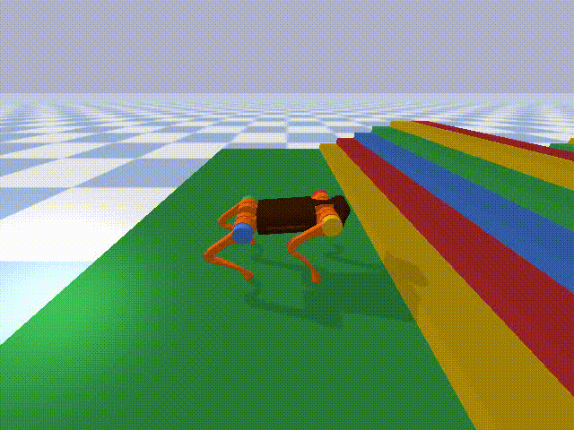

# Quadrupedal
Quadrupedal is a physical simulation platform for unitree A1 robot based on pybullet and https://github.com/google-research/motion_imitation.

Please consider to cite this environment if it can help your research.



## Install

```python
pip install rlschool
```

#### For local installation, execute following commands:

```python
git clone https://github.com/PaddlePaddle/RLSchool
cd RLSchool
pip install .
```
## Quick Start
Quadrupedal environment follows the standard gym APIs to create, run and close an environment.

```python
# We show a simple example to start Quadrupedal here
from rlschool import make_env
import numpy as np
env = make_env('Quadrupedal',render=1,task="stairstair")
observation,info = env.reset()
for i in range(100):
    action = np.random.uniform(-0.3,0.3,size=12)
    next_obs, reward, done, info = env.step(action)
```
## Specify a Task
There are nine predefined tasks in this environment.

"stairstair": Climb up and down stairs

"stairslope": Climb up stairs and down slopes

"slopestair": Climb up slopes and down stairs

"slopeslope": Climb up and down slopes

(Above stair height is 8 cm and width is 25 cm, slope is around 20 degree)

"highstair": Climb up stairs with stair height of 13 cm

"heightfield": Walk over heightfield

"balancebeam": Walk over a balance beam with width of 10 cm

"cliff": Gallop over big gaps with width of 50 cm

"Cave": Crawl into caves with height of 18 cm


To specify a task, we can change the value of task in make_env function, for example to select "balancebeam"

```python
# We show a simple example to start LiftSim here
from rlschool import make_env
import numpy as np
env = make_env('Quadrupedal',render=1,task="balancebeam")
observation,info = env.reset()
for i in range(100):
    action = np.random.uniform(-0.3,0.3,size=12)
    next_obs, reward, done, info = env.step(action)
```

## Action

Our action a(t) is a 12 dim vector, corresponding to the desired joint angle of 12 joints. The desired joint angle will be sent to a low level PD controller to control the motor.

We have defined a default joint angle as J_default = [0,0.9,-1.8,0,0.9,-1.8,0,0.9,-1.8,0,0.9,-1.8], the final output will be J_final = a(t) + J_default.

## Observation

| Name                    | Dim    | Description                                |
| :----------------------:| :-----: | :----------------------------------------: |
| Distance                   | 3   | The movement of body                 |
| Motor Angle            | 12     | The current motor angle                |
| Motor Angle ACC                | 12   | The accelerate of motor angle         |
| IMU            | 6   | Yaw, Pitch, Roll, d_Yaw, d_Pitch, d_Roll              |
| Contact               | 4     | The foot contact information          |

## Reward

The simple reward is the movement of the body along the x axis.


