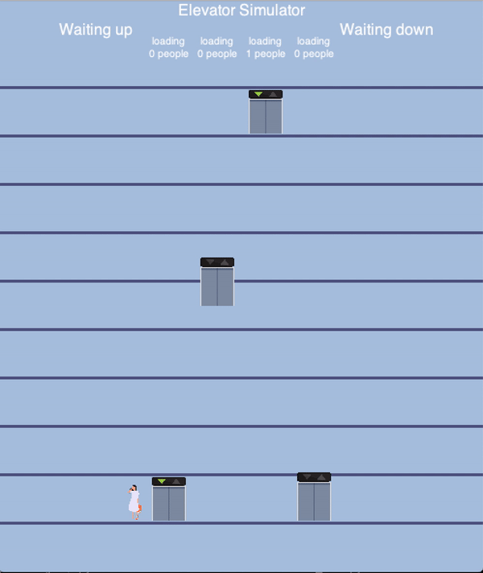

# LiftSim

LiftSim是一个电梯调度模拟环境




## 下载

可以通过pip下载：

```python
pip install rlschool
```


## 基本接口

类似gym，liftsim提供了三个基本接口：

- reset(self)：重置环境，返回observation。
- step(self, action)：根据action调整环境，返回observation，reward，done，info。此环境中0.5秒为一个timestep。
- render(self)：显示一个timestep内的环境。

### 参数

传入step方法的action为一个长度为2\*n的list，n为电梯数，在第一轮中为4。2*n个数字每连续两个数字为代表一部电梯的控制指令，其中前一个数字表示分配到的楼层（DispatchTarget），后一个数字代表分配到的方向（DispatchTargetDirection）。DispatchTarget可以为-1和0，为-1时表示不改变之前的DispatchTarget；为0时
表示要求电梯立即停下。

```python
from rlschool import LiftSim

env = LiftSim()
observation = env.reset()
action = [1, 0, 1, 0, 1, 0, 1, 0]
for i in range(100):
    next_obs, reward, done, info = env.step(action)
```

## 大楼状态

reset(self)和step(self, action)返回一个namedtuple，MansionState。

- MansionState：namedtuple，表示电梯整体情况。大楼最高十层，每层4.0米高，大楼共有四部电梯。

|名字                       |类型                  |描述            |
|--------------------------|----------------------|---------------|
|ElevatorStates            |List of ElevatorState |存储所有电梯的状态|
|RequiringUpwardFloors     |List of int           |有人等待向上的楼层|
|RequiringDownwardFloors   |List of int           |有人等待向下的楼层|


- ElevatorState：namedtuple ，表示各个电梯的状态。

| 名字                    | 类型     | 描述                              |
| :----------------------:| :-----: | :------------------------------: |
| Floor                   | float   | 电梯当前楼层                       |
| MaximumFloor            | int     | 大楼最高楼层                       |
| Velocity                | float   | 电梯当前速度                       |
| MaximumSpeed            | float   | 电梯最大速度                       |
| Direction               | int     | 电梯方向，-1为向下，1为向上，0为无方向 |
| DoorState               | float   | 电梯门当前打开的比例                |
| CurrentDispatchTarget   | int     | 电梯当前分配到的目标楼层             |
| DispatchTargetDirection | int     | 电梯分配到的方向                    |
| LoadWeight              | float   | 电梯当前承载的质量                  |
| MaximumLoad             | float   | 电梯最大能承载的质量                |
| ReservedTargetFloors    | list    | 存储电梯内乘客的目标楼层             |
| OverloadedAlarm         | float   | 指示电梯是否超载                    |
| DoorIsOpening           | boolean | 指示电梯门是否正在打开               |
| DoorIsClosing           | Boolean | 指示电梯门是否正在关闭               |


## 示例

我们提供了基于Deep Q-network实现的电梯调度算法[示例][demo]，其中含有对于MansionState以及ElevatorState处理的方法。

## 评价标准

根据三个部分评分：

- 电梯内乘客等待时长以及电梯外人们排队时长，单位：秒；
- 电梯消耗的能量，单位：焦；
- 放弃的人数（排队的人五分钟后自动放弃），单位：人。

公式：

```python
- (time_consume + 0.01 * energy_consume + 100 * given\_up\_persons) * 1e-4
```

计算28800 steps，即模拟环境内四小时之后的总得分。

## 提交

提交文件需包括调控电梯的代码、requirements.txt文件以及运行的shell文件

- 代码：除环境以外的部分。    TODO: 配置好docker环境后修改

- requirements.txt：所需依赖包。

- shell文件：包括用pip下载requirements.txt文件以及运行代码的命令。比赛环境提供python3和python2.7命令。

在[此处][submit]提交结果


[demo]: https://github.com/Banmahhhh/RLSchool/blob/master/liftsim/demo.py
[submit]: https://www.google.com/
