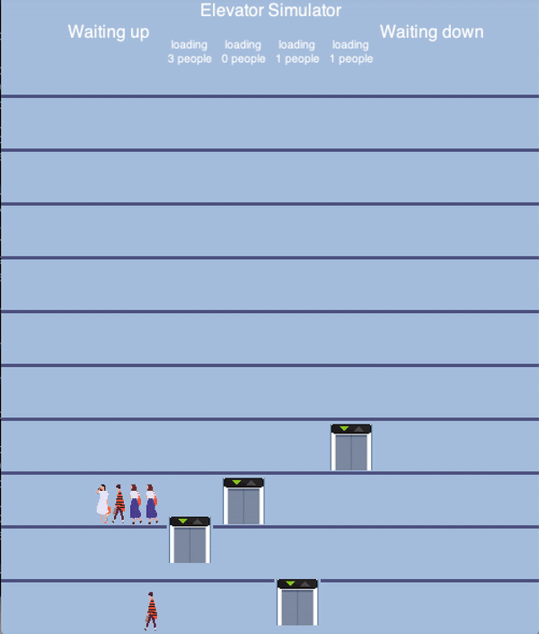
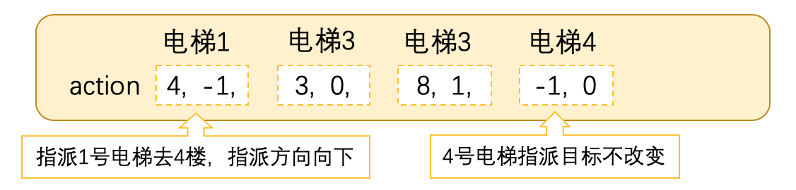

# LiftSim

LiftSim是一个电梯调度模拟环境。
如在您研究工作中使用了该环境，请引用下面的标记

```txt
@misc{LiftSim,
    author = {Fan Wang, Bo Zhou, Yunxiang Li, Kejiao Li},
    title = {{LiftSim: a configurable lightweight simulator of elevator systems}},
    year = {2020},
    publisher = {GitHub},
    journal = {GitHub repository},
    howpublished = {\url{https://github.com/PaddlePaddle/RLSchool/tree/master/rlschool/liftsim}},
}
```




## 安装

#### 通过pip安装：

```python
pip install rlschool
```

#### 在本地安装：

```python
git clone https://github.com/PaddlePaddle/RLSchool
cd RLSchool
pip install .
```


## 基本接口

类似[gym][gym]，liftsim提供了三个基本接口：

- reset(self)：重置环境，返回observation。
- step(self, action)：根据action调整环境，返回[observation](#Observation)，[reward](#Reward)，done，info。每运行一次step()，电梯模拟器内部运行0.5秒，即一个timestep。
    - done：电梯属于连续任务，没有回合制概念，因此done一直为False。
    - info：一个dictionary，包括人们等待的时间time_consume（float）、能量消耗energy_consume（float）、放弃等待的人数given_up_persons（int）。详细解释见[Reward](#Reward)。
- render(self)：渲染一帧图像，显示当前电梯内部的环境。

```python
# 以下是一个简单可运行的电梯模拟器的例子
from rlschool import make_env

env = make_env('LiftSim')
observation = env.reset()
action = [2, 0, 4, 0, 7, 0, 10, 0]
for i in range(100):
    env.render()    # use render to show animation
    next_obs, reward, done, info = env.step(action)
```

### Action

传入step方法的action为一个长度为2\*n的list，表示对n个电梯的指令集合（在比赛中，电梯数量n固定为4），每条指令由2个数字组成。2*n个数字每连续两个数字代表一部电梯的控制指令：
- 其中第一个数字表示分配到的楼层（DispatchTarget）。DispatchTarget为1~MaxFloorNumber时表示调配到相应楼层（MaxFloorNumber代表最高楼层，第一轮比赛中固定为10）；为-1时表示不改变之前的DispatchTarget；为0时表示要求电梯立即停下。
- 后一个数字代表分配到的方向（DispatchTargetDirection）。可以为-1（向下），0（无方向），1（向上）。




## Observation

reset(self)和step(self, action)返回当前大楼的MansionState，详细含义如下：

- MansionState：namedtuple，表示电梯整体情况。第一轮比赛中大楼最高十层，每层4.0米高，大楼共有四部电梯。

|名字                       |类型                  |描述            |
|--------------------------|----------------------|---------------|
|ElevatorStates            |List of ElevatorState |存储所有电梯的状态|
|RequiringUpwardFloors     |List of int           |有人等待向上的楼层|
|RequiringDownwardFloors   |List of int           |有人等待向下的楼层|


- ElevatorState：namedtuple ，表示各个电梯的状态。

| 名字                    | 类型     | 描述                                        |
| :----------------------:| :-----: | :----------------------------------------: |
| Floor                   | float   | 电梯当前楼层                                 |
| MaximumFloor            | int     | 大楼最高楼层                                 |
| Velocity                | float   | 电梯当前速度                                 |
| MaximumSpeed            | float   | 电梯最大速度                                 |
| Direction               | int     | 电梯方向，-1为向下，1为向上，0为无方向           |
| DoorState               | float   | 电梯门当前打开的比例，0.0为完全关闭，1.0为完全开启|
| CurrentDispatchTarget   | int     | action中指定的目标楼层（若电梯需停下时，则为0）   |
| DispatchTargetDirection | int     | action中指定的方向                           |
| LoadWeight              | float   | 电梯当前承载的质量（kg）                       |
| MaximumLoad             | float   | 电梯最大能承载的质量（kg）                     |
| ReservedTargetFloors    | list    | 存储电梯内乘客的目标楼层，即电梯内被按下的楼层按键 |
| OverloadedAlarm         | float   | 电梯是否超载倒计时，有超载情况则倒计时两秒        |
| DoorIsOpening           | boolean | 指示电梯门是否正在打开                         |
| DoorIsClosing           | Boolean | 指示电梯门是否正在关闭                         |


## 示例

我们提供了基于Deep Q-network实现的电梯调度算法[示例][demo]，其中含有对于MansionState以及ElevatorState的特征处理的方法，供参赛者参考。
该基线使用第一轮数据，若用于第二轮比赛，可加入时间特征，即运行时长 (total_step * time_step) % 86400，(total_step * time_step)为当前模拟器内的时间，单位为秒。

## Reward

根据三个部分计算：

- time_consume：所有乘客在一个timestep内等待时长的加和（在乘客未到达目的楼层之前，都处于等待状态），单位：秒；
- energy_consume：一个timestep内电梯消耗的能量，单位：焦；
- given_up_persons：一个timestep内放弃的人数（电梯外排队的人五分钟后自动放弃），单位：人。

### 第一轮计算公式

```python
reward = - (time_consume + 0.01 * energy_consume + 100 * given_up_persons) * 1e-4
```

### 第二轮计算公式

```python
reward = - (time_consume + 5e-4 * energy_consume + 300 * given_up_persons) * 1e-4
```

### 比赛评分

- 第一轮：计算4 \* 3600 * 2 steps（即模拟环境内四小时）的reward总和。
- 第二轮：计算24 \* 3600 \* 3 * 2 steps（即模拟环境内三天）的reward平均值。

## 人流产生模式

可以在[config.ini][config]中修改[PersonGenerator]部分来选择人流产生模式：

### 均匀人流模式

```ini
[PersonGenerator]
PersonGeneratorType = UNIFORM
ParticleNumber = 12
GenerationInterval = 150
```

PersonGeneratorType为UNIFORM时即使用均匀人流，人流产生与时间无关。修改ParticleNumber和GenerationInterval可改变人流产生密度。

### 自定义人流模式

```ini
[PersonGenerator]
PersonGeneratorType = CUSTOM
CustomDataFile = mansion_flow.npy
```
PersonGeneratorType为CUSTOM时即使用自定义人流模式，人流产生与时间有关。CustomDataFile为人流分布数据。

## 提交

- 第一轮：

    提交文件需包括调控电梯的代码、requirements.txt文件以及运行的shell脚本：

    - 代码：参赛者编写的调度算法，通过LiftSim提供的step()接口与环境交互。

    - requirements.txt：依赖包。

    - shell脚本：shell文件的作用是激活环境、下载requirements.txt文件以及运行代码。评估环境使用anaconda环境：". activate py2"激活Python2.7环境；". activate py3"激活Python3.6环境。**shell文件命名为run_main.sh**，示例：
    ```shell
    #!/bin/bash
    # run_mansion.sh
    . activate py3 # 激活环境，可选择使用py2（Python2.7）或者py3（Python3.6）
    pip install -r requirements.txt # 安装requirements.txt文件中的依赖库
    python main.py  # 自定义代码运行命令
    ```

    将以上文件打包成zip文件，我们提供了[示例][submit_folder]。参赛者在[此处][submit]提交结果。

[gym]: https://gym.openai.com/
[demo]: https://github.com/PaddlePaddle/PARL/tree/r1.3/examples/LiftSim_baseline/DQN
[submit]: https://aistudio.baidu.com/aistudio/competition/detail/11
[submit_folder]: https://github.com/Banmahhhh/RLSchool/blob/master/rlschool/liftsim/submit_folder.zip
[config]: https://github.com/PaddlePaddle/RLSchool/blob/master/rlschool/liftsim/config.ini
