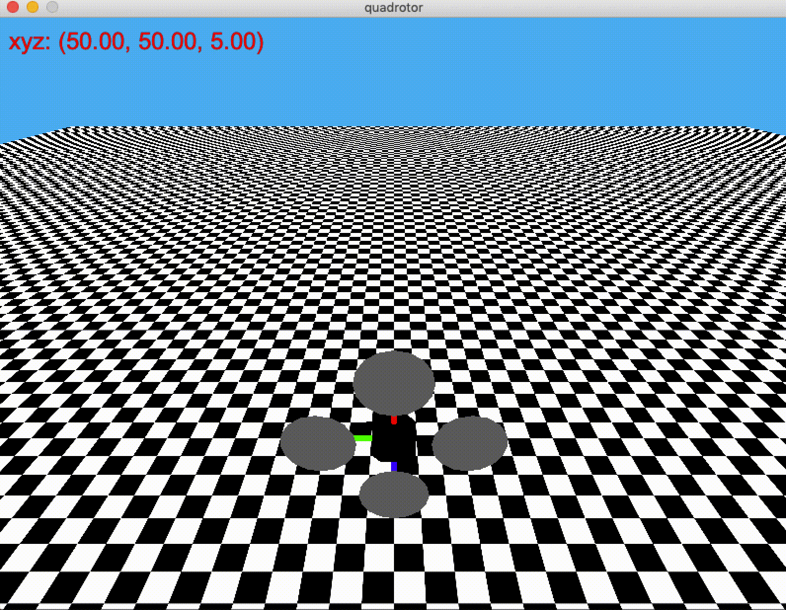
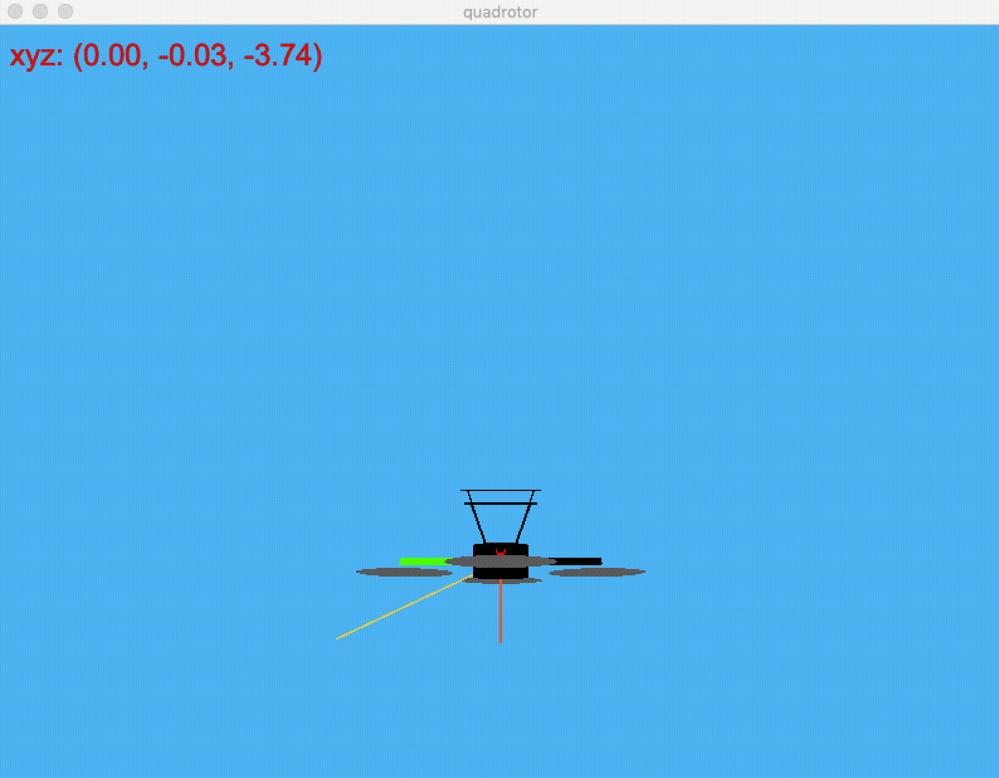
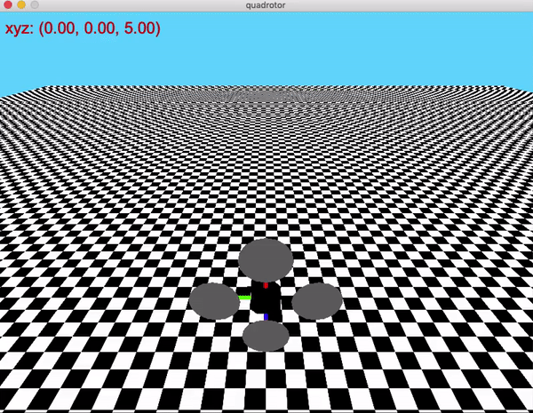

English | [简体中文](./README_zh.md)

# Quadrotor

Please consider to cite this environment if it can help your research.

```txt
@misc{Quadrotor,
    author = {Yang Xue, Fan Wang and Bo Zhou},
    title = {{A configurable lightweight simulator of quad-rotor helicopter}},
    year = {2020},
    publisher = {GitHub},
    journal = {GitHub repository},
    howpublished = {\url{https://github.com/PaddlePaddle/RLSchool/tree/master/rlschool/quadrotor}},
}
```

## Install

```sh
pip install rlschool
```

For local installation, execute following commands:

```sh
git clone https://github.com/PaddlePaddle/RLSchool
cd RLSchool
pip install .
```

## Test Visualization

```sh
# For 'no_collision' task
python -m rlschool.quadrotor.env

# For 'velocity_control' task
python -m rlschool.quadrotor.env velocity_control
```

* "no_collision" task



* "velocity_control" task



Yellow arrow is the expected velocity vector; orange arrow is the real velocity vector.

* "hovering_control" task



Notice that the coordinate system is shown as following:


And the initial position of the drone is (0, 0, 5).

## Example

Quadrotor environment follows the standard [gym][gym] APIs to create, run, render and close an environment. Currently, Quadrotor supports two tasks: "no_collision" and "velocity_control".

To create a quadrotor environment for "no_collision" task:

```python
from rlschool import make_env
env = make_env("Quadrotor", task="no_collision", map_file=None, simulator_conf=None)
env.reset()
```

When the argument `map_file` is `None`, the world is a 100x100 flatten floor. Once the drone hits the floor, the environment episode terminates. The map file is a text file like [default_map.txt][map_example], in which each number represents the height of obstacle wall in corresponding location. `-1` marks the initial location of the drone. If needed, you can set `map_file` to the path of a custom map file.

When the argument `simulator_conf` is `None`, the environment would use the default simulator configuration [config.json][default_sim_conf]. If you want to change the dynamics of the drone, you need to create a new _config.json_, and set `simulator_conf` to the path of the new _config.json_.

To create a quadrotor environment for "velocity_control" task:

```python
from rlschool import make_env
env = make_env("Quadrotor", task="velocity_control", seed=0)
env.reset()
```

The argument `seed` is used for sampling a trajectory of expected velocity vectors. Its default value is `0`.

To create a quadrotor environment for "hovering_control" task:

```python
from rlschool import make_env
env = make_env("Quadrotor", task="hovering_control")
env.reset()
```

### Action

The action for Quadrotor environment is the respective voltage value of four propeller motors. Each voltage value is in range `[0.10, 15.0]`, by default, which is set in [config.json](default_sim_conf).

As you expected, action `[1.0, 1.0, 1.0, 1.0]` would lead straight top-down movement. Please check the visualization using following code:

```python
from rlschool import make_env

env = make_env("Quadrotor", task="no_collision")
env.reset()
env.render()

reset = False
while not reset:
    state, reward, reset, info = env.step([1.0, 1.0, 1.0, 1.0])
    env.render()
```

### State

The state of the drone belongs to three categories: sensor measurements, flighting state and task related state.

#### Sensor Measurements

* `acc_x`: the measurement of accelerometer in x direction.
* `acc_y`: the measurement of accelerometer in y direction.
* `acc_z`: the measurement of accelerometer in z direction.
* `gyro_x`: the measurement of gyroscope in x direction.
* `gyro_y`: the measurement of gyroscope in y direction.
* `gyro_z`: the measurement of gyroscope in z direction.
* `z`: the vertical distance to the floor measured by barometer.
* `pitch`: body rotation angular around the x axis.
* `roll`: body rotation angular around the y axis.
* `yaw`: body rotation angular around the z axis.

Note that `pitch`, `roll` and `yaw` are the accumulation of gyroscope measurements along the time elapses, so we group them as sensor measurements.

#### Flighting State

* `b_v_x`: velocity of the drone in x direction, in its own body coordinate.
* `b_v_y`: velocity of the drone in y direction, in its own body coordinate.
* `b_v_z`: velocity of the drone in z direction, in its own body coordinate.

#### Task Related State

For "velocity_control" task, it has:

* `next_target_g_v_x`: next expected velocity of the drone in x direction, in global coordinate.
* `next_target_g_v_y`: next expected velocity of the drone in y direction, in global coordinate.
* `next_target_g_v_z`: next expected velocity of the drone in z direction, in global coordinate.

[gym]: https://gym.openai.com/
[map_example]: https://github.com/PaddlePaddle/RLSchool/blob/master/rlschool/quadrotor/default_map.txt
[default_sim_conf]: https://github.com/PaddlePaddle/RLSchool/blob/master/rlschool/quadrotor/config.json
