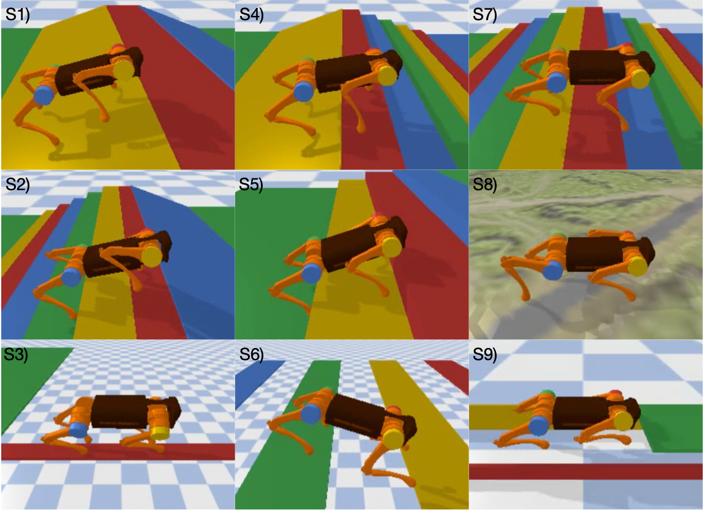

# Quadrupedal
Quadrupedal is a physical simulation platform for unitree A1 robot based on pybullet and https://github.com/google-research/motion_imitation.

Please consider to cite this environment if it can help your research.



## Install
```python
git clone https://github.com/PaddlePaddle/RLSchool
cd RLSchool
pip install .
```
## Quick Start
Quadrupedal environment follows the standard gym APIs to create, run and close an environment.

```python
# We show a simple example to start Quadrupedal here
import rlschool
import numpy as np
env = rlschool.make_env('Quadrupedal',render=1,task="stairstair")
observation = env.reset()
for i in range(100):
    action = np.random.uniform(-0.3,0.3,size=12)
    next_obs, reward, done, info = env.step(action)
```

## Arguments

| Name                    | Type    | Description                                |
| :----------------------:| :-----: | :----------------------------------------: |
| render                   | bool   | Render the environment or not.                 |
| task            | string     | Select the task.                |
| sensor_mode                | dict   | Select the sensors used for observation.         |
| normal            | bool   | Normalize the observation or not.              |
| random_param               | dict     | Randomize the dynamic parameters and external force.          |
| reward_param               | dict     | Specify the weight of each reward term.          |
| vel_d               | float     | The maximum of desired speed.           |
| step_y               | float     | Specify the foot position at y axis for balance beam task.           |
| ETG               | bool     | Use ETG to produce open loop control signals or not.          |
| ETG_path               | string     | The path of ETG params.          |
| ETG_T               | float     | The period of ETG.          |

## Specify a Task
There are ten predefined tasks in this environment.

| Task                        | Description                                |
| :----------------------:|  :----------------------------------------: |
| "stairstair"                    | Climb up and down the stair|
| "stairslope"                 | Climb up the stair and down the slope        |
| "slopestair"                  | Climb up the slope and down the stair         |
| "slopeslope"               | Climb up and down the slope    |
| "stair13"                   | Climb up the stair with height of 13 cm         |
| "terrain"                   |  Walk over terrain        |
| "balancebeam"                   |  Walk over the balance beam with width of 10 cm       |
| "gallop"                  |  Gallop over big gaps with width of 50 cm     |
| "Cave"                  |  Crawl into caves with height of 18 cm    |
| "ground"                  |  Walk on a flat ground.    |

For above tasks except "stair13", the stair height is 8 cm and width is 25 cm, the slope is around 20 degree.


To specify a task, we can change the value of task in make_env function, for example to select "balancebeam"

```python
import rlschool
import numpy as np
env = rlschool.make_env('Quadrupedal',render=1,task="balancebeam")
```

## ETG mode

If we use ETG mode, we should modify the arguments ETG and ETG_path, for example

```python
import rlschool
import numpy as np
env = rlschool.make_env('Quadrupedal',render=1,task="stairstair",ETG=True,ETG_path="ESStair_origin.npz")
```


## Action

Our action a(t) is a 12 dimen vector, corresponding to the desired joint angle of 12 joints. The desired joint angle will be sent to a low level PD controller to control the motor.

Note that we have defined a default joint angle as J_default = [0,0.9,-1.8]*4, the final output will be J_final = a(t) + J_default.

If we use the ETG mode, then the final output will be  J_final = ETG(t)+ a(t) + J_default.

The action bound of J_final is between [-0.802,-1.047,-2.696]*4 and [0.802,4.188,-0.916]*4. In our experiments we use action bound of [-0.7]*12 to [0.7]*12.


## Observation

| Name                    | Dimension    | Description                                |
| :----------------------:| :-----: | :----------------------------------------: |
| Speed                   | 3   | The speed of the robot at the global coordinate.                 |
| Motor Angle            | 12     | The current motor angle                |
| Motor Angle ACC                | 12   | The accelerate of motor angle         |
| IMU            | 6   | Yaw, Pitch, Roll, d_Yaw, d_Pitch, d_Roll              |
| Contact               | 4     | Four bool variables indicating if the whether foot is touching the ground.          |
| ETG               | 12     | ETG ouput.          |
| footpose               | 12     | Four feet position at the body coordinate.          |

By default we use [Speed, Motor Angle, Motor Angle ACC, IMU , Contact] as our observation.

## Reward

| Name                        | Description                                |
| :----------------------:|  :----------------------------------------: |
| torso                    | Reward the speed of the robot body along desired direction at the global coordinate.                 |
| up                 | Reward to keep roll and pitch term small.         |
| feet                  | Reward to move the feet forward along desired direction.         |
| tau               | Punish the energy cost.     |
| footcontact                   | Reward the time of foot contact with the ground.          |
| badfoot                   | Punish other joints except foot to contact with the ground.         |


